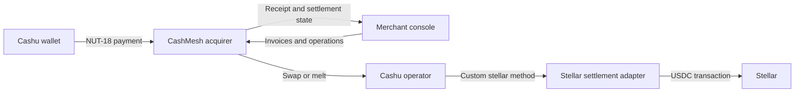
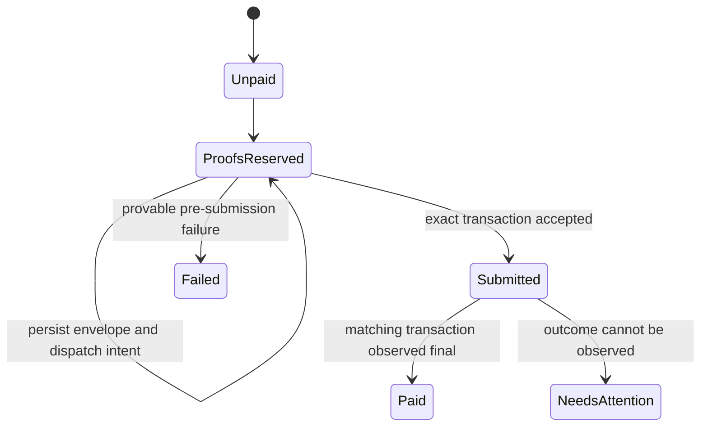
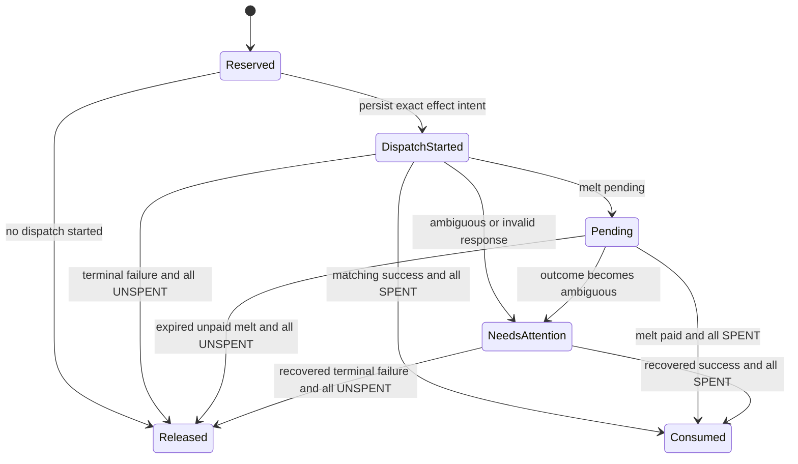

# Architecture

## Goals

CashMesh gives a merchant one acquiring interface over explicitly supported Cashu operators and settles
merchant value through Stellar. It must preserve the distinction between operator liabilities and make
ambiguous external effects recoverable.

The initial architecture optimizes for:

- deterministic policy and accounting logic;
- stock Cashu implementation compatibility;
- exact Stellar asset validation;
- at-most-once external payout behavior;
- independently deployable merchant, acquirer, and operator surfaces; and
- testability without funded accounts.

It does not initially optimize for net clearing, merchant-offline finality, private Stellar ingress or
egress, fiat payout, or horizontal service decomposition.

## Context



## Component Boundaries

### Domain Package

`packages/domain` owns rules that do not require a framework, database, Cashu library, or Stellar
client:

- integer minor-unit validation;
- operator tier and settlement-mode policy;
- versioned invoice lifecycle rules;
- balanced, operator-aware invoice-payment journals; and
- future ports for external effects.

It may depend only on small, runtime-independent utilities with a demonstrated need.

### Cashu Request Adapter

`packages/cashu` maps a validated open invoice and accepted operator routes to a strict NUT-18
request. It also inspects bounded raw payment payloads and returns only non-secret envelope metadata.
It validates proof integrity and input fees against an explicit, versioned public-key snapshot without
performing network I/O during proof validation. A separate source port and bounded HTTPS adapter can
collect one unit's NUT-01 and NUT-02 data, reject a rotation between two metadata reads, and pass the
joined result through the same snapshot validator. It owns Cashu wire encoding, endpoint normalization,
transport-size limits, versioned policy records, and derivation of sanitized NUT-07 proof references.
The custody-specific validator can additionally return a redacted, explicitly serializable bearer
bundle after the same strict DLEQ verification. It strips DLEQ data and rejects spending conditions.
A second source port and bounded HTTPS adapter can query NUT-07 with only those references, enforce an
exact ordered response, discard witnesses, and return an immutable in-memory state snapshot. It does
not persist or schedule state observations, change proof reservations, or decide that an invoice has
been paid. A separate bounded NUT-05 client can create and check the custom `stellar` melt quote before
bearer dispatch. It validates the exact testnet USDC SEP-0007 profile, accepts only current UUIDv7 quote
identifiers, and binds every check to the original amount, request, fee, method, unit, mint, and expiry.
It does not itself persist the quote. A separate bounded execution client can project a live custody
bundle into one zero-fee NUT-05 request. It fingerprints the exact endpoint and body, requires a caller
authorization before the request, performs no retry, and returns only matching common quote fields.
A separate acquirer repository persists one creation attempt per reserved payment before the POST,
retains an ambiguous outcome without retry, and appends exact quote observations across restart. A
melt lifecycle effect can start only from the same payment's matching, unexpired, currently `UNPAID`
quote evidence. No application coordinator invokes the execution client yet.

The adapter pins a current release-candidate cashu-ts version behind this boundary. Its deterministic
`creqA` fixture is decoded by both cashu-ts and the independently pinned CDK types. See the
[merchant payment-request profile](cashu-payment-requests.md).

### Acquirer API

`services/acquirer-api` is the merchant-facing application boundary. It will own:

- invoice creation and lifecycle;
- NUT-18 request issuance and payment receipt;
- proof validation orchestration;
- operator policy evaluation;
- merchant ledger entries;
- settlement scheduling;
- receipts, refund records, webhooks, and reconciliation; and
- manual-attention workflows.

The API exposes health, operator-policy evaluation, durable open-invoice plus strict NUT-18 request
creation and lookup, and a non-accepting payment-envelope endpoint. Its storage adapters also persist
append-only keyset evidence, local non-bearer proof-reference reservations, payment-scoped NUT-07 state
evidence, pre-dispatch Stellar quote attempts and observations, an append-only reservation lifecycle,
and reservation-bound encrypted bearer custody. The
lifecycle binds one canonical dispatch fingerprint, preserves ambiguous effects, and requires matching
exact proof-state evidence before consumption or release. Terminal lifecycle events delete current
ciphertext transactionally while an
append-only nonce-use record remains. These adapters are not wired into the endpoint. Production key
management, operator dispatch, authentication, proof acceptance, and terminal invoice transitions are
not yet implemented.

### Merchant Console

`apps/merchant-console` is a reference operational client. It must remain replaceable by hosted
checkout, ecommerce plugins, or direct API clients. The current data is explicitly labeled as fixture
data and no payment state is presented as a live network result.

### Stellar Settlement Crate

`crates/stellar-settlement` owns the custom CDK payment boundary, exact Stellar profile, deposit
observer, durable compatibility journal, and payout recovery state. A pinned stock CDK gRPC server and
a read-only Horizon client adapt to its ports. Transaction signing and submission remain outside the
crate's implemented network effects. Submission must never be conflated with successful payment.

The current state model is:



Preparation metadata is persisted while the public state remains `proofs_reserved`. A final failed
ledger observation for that exact hash can terminate the obligation, but a timeout cannot. Once an
external effect may exist, the adapter observes its remote state before deciding whether proofs can be
released.

The separate acquirer proof-reservation lifecycle is:



## Dependency Direction

```text
merchant-console -----> domain
acquirer-api ----------> domain
acquirer-api ----------> Cashu request adapter
acquirer-api ----------> PostgreSQL
Cashu request adapter -> domain
Cashu request adapter -> cashu-ts
Cashu keyset client ---> configured operator HTTPS endpoint
Cashu quote client ----> configured operator HTTPS endpoint
Cashu melt client -----> configured operator HTTPS endpoint
Cashu processor ------> stellar-settlement
Horizon reader -------> stellar-settlement
future payout signer --> stellar-settlement

domain ----------------> no application or network framework
stellar-settlement ----> no network client yet
```

The application layer may coordinate ports. Network adapters must not become the source of accounting
truth.

## Merchant Accounting Boundary

Payment acceptance is one domain operation that returns a paid invoice and its journal together. The
journal reference binds invoice, merchant, payment, operator, and settlement mode. Its posting shape is
limited to one operator e-cash or settlement-asset debit, one matching merchant-payable credit, and an
optional fee-revenue credit.

The invoice validity interval is `[createdAt, expiresAt)`. Payment and cancellation are invalid at the
expiry second; expiration is valid from that second onward. See the
[merchant accounting contract](merchant-accounting.md) for the version `1` fields and persistence
requirements.

## Operator Policy

| Operator tier | Requested hold | Requested conversion | Default |
|---|---|---|---|
| Trusted | Hold | Convert | Hold |
| Convertible-only | Convert | Convert | Convert |
| Unlisted | Reject | Reject | Reject |

This is merchant policy, not a universal operator rating. The same operator can receive a different
tier, cap, or suspension status for a different merchant.

## Money Representation

All business values use integer minor units. For initial USDC settlement:

```text
1 CashMesh usdc unit = 1 US cent
100 units = USDC 1.00
```

String parsing must reject signs, exponents, separators, and more than two decimal places. Serialization
schemas must declare integer bounds. Stellar's native asset precision must not cause silent rounding
into Cashu cents.

## Persistence

The settlement compatibility crate has a single-process, atomically replaced JSON journal to prove
cursor, claim, prepared-envelope, and payout recovery across restart. It is not the production database
or a multi-process coordination mechanism.

PostgreSQL is selected for acquirer persistence. The implemented migrations store open invoice
issuance, merchant-scoped idempotency, encoded Cashu requests, normalized operator-policy routes, and
append-only Cashu keyset evidence, proof references, and proof-state observations. Database constraints
require the invoice-creation reservation, invoice, request, and at least one accepted route to commit
together. A separate keyset repository preserves immutable identity across operators, records activity
per observation, and retrieves only observations inside a caller-supplied freshness interval. The
proof-reference repository binds an exact observation and issued operator route, then enforces one
active claim per `(mint URL, Y)` across restarts and concurrent workers. The proof-state repository
binds every complete observation to that exact reservation, preserves terminal `SPENT` history, and
also requires a caller-supplied freshness interval. The lifecycle repository stores immutable effect
and transition evidence, keeps ambiguous claims active, and removes claims only for a proven release.
The custody repository stores only authenticated ciphertext and metadata, binds decryption to the exact
reservation, rejects key/nonce reuse across terminal histories, and exposes plaintext only through a
self-destroying callback. Its local AES adapter uses a key-provider port; no production KMS or HSM
adapter exists. The quote repository requires that custody and the active reservation before it grants
one creation authorization, binds one quote identity per mint, retains ambiguous creation, and prevents
state regression after `PAID`. The lifecycle repository and a database trigger require every new melt
effect to match that payment's mint, quote ID, expiry, and dispatch-time `UNPAID` observation.
Historical reads retain that binding while permitting later `PENDING` or `PAID` observations.
Repositories reconstruct stored records through validated adapters before return. See the
[merchant invoice API](invoice-api.md) for request and replay semantics.

Later migrations must preserve the fixed invoice and recovery contracts and provide atomic
transitions for:

- confirmed proof consumption, terminal invoice state, and the balanced merchant journal;
- one idempotency key to one external payout attempt;
- merchant ledger debit/credit pairs;
- webhook delivery attempts; and
- reconciliation checkpoints.

An append-only event log may complement relational state, but it cannot replace enforceable uniqueness
and balance constraints.

## Deployment Shape

The first deployable environment should use:

- one merchant console;
- one acquirer API;
- one PostgreSQL database;
- two independently configured Cashu test operators; and
- one Stellar testnet settlement adapter per operator or clearly isolated account domain.

Splitting the acquirer into more services is deferred until operational load or ownership boundaries
justify it.

## Architecture Decisions

- [ADR-0001: Hybrid workspace boundaries](adr/0001-hybrid-workspace.md)
- [ADR-0002: Operator liabilities remain distinct](adr/0002-distinct-operator-liabilities.md)
- [ADR-0003: Direct settlement precedes clearing](adr/0003-direct-settlement-before-clearing.md)
- [ADR-0004: Stock CDK external processor for Stellar](adr/0004-stock-cdk-stellar-processor.md)
- [ADR-0005: Atomic merchant accounting](adr/0005-atomic-merchant-accounting.md)
- [ADR-0006: Isolated NUT-18 request adapter](adr/0006-isolate-nut18-request-adapter.md)
- [ADR-0007: PostgreSQL invoice issuance](adr/0007-postgres-invoice-issuance.md)
- [ADR-0008: Persisted Cashu request snapshots](adr/0008-persist-cashu-request-snapshots.md)
- [ADR-0009: Reject unverified Cashu payments](adr/0009-reject-unverified-cashu-payments.md)
- [ADR-0010: Offline Cashu proof validation](adr/0010-validate-cashu-proofs-offline.md)
- [ADR-0011: Bounded Cashu keyset observation](adr/0011-observe-cashu-keysets.md)
- [ADR-0012: Durable Cashu keyset evidence](adr/0012-persist-cashu-keyset-evidence.md)
- [ADR-0013: Durable Cashu proof references](adr/0013-reserve-cashu-proof-references.md)
- [ADR-0014: Bounded Cashu proof-state observation](adr/0014-observe-cashu-proof-state.md)
- [ADR-0015: Durable Cashu proof-state evidence](adr/0015-persist-cashu-proof-state-evidence.md)
- [ADR-0016: Cashu proof-reservation lifecycle](adr/0016-manage-cashu-proof-reservation-lifecycle.md)
- [ADR-0017: Encrypted Cashu bearer-proof custody](adr/0017-protect-cashu-bearer-proof-custody.md)
- [ADR-0018: Bound Stellar melt quote terms](adr/0018-bound-stellar-melt-quotes.md)
- [ADR-0019: Durable Stellar melt quote evidence](adr/0019-persist-stellar-melt-quote-evidence.md)
- [ADR-0020: Require quote evidence for melt effects](adr/0020-require-quote-evidence-for-melt-effects.md)
- [ADR-0021: Authorize bounded zero-fee Stellar melt dispatch](adr/0021-authorize-zero-fee-stellar-melt-dispatch.md)
