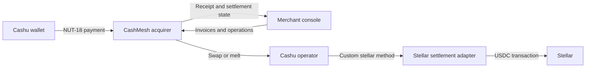
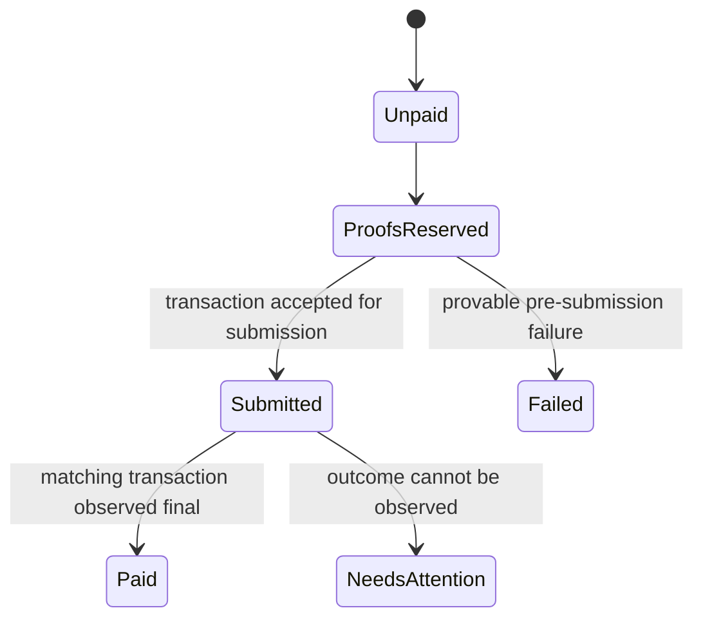

# Architecture

## Goals

CashMesh gives a merchant one acquiring interface over explicitly supported Cashu operators and settles
merchant value through Stellar. It must preserve the distinction between operator liabilities and make
ambiguous external effects recoverable.

The initial architecture optimizes for:

- deterministic policy and accounting logic;
- stock Cashu implementation compatibility;
- exact Stellar asset validation;
- at-most-once external payout behavior;
- independently deployable merchant, acquirer, and operator surfaces; and
- testability without funded accounts.

It does not initially optimize for net clearing, merchant-offline finality, private Stellar ingress or
egress, fiat payout, or horizontal service decomposition.

## Context



## Component Boundaries

### Domain Package

`packages/domain` owns rules that do not require a framework, database, Cashu library, or Stellar
client:

- integer minor-unit validation;
- operator tier and settlement-mode policy;
- future invoice, fee, and merchant-ledger invariants; and
- future ports for external effects.

It may depend only on small, runtime-independent utilities with a demonstrated need.

### Acquirer API

`services/acquirer-api` is the merchant-facing application boundary. It will own:

- invoice creation and lifecycle;
- NUT-18 payment-request construction;
- proof validation orchestration;
- operator policy evaluation;
- merchant ledger entries;
- settlement scheduling;
- receipts, refund records, webhooks, and reconciliation; and
- manual-attention workflows.

The scaffold exposes health and operator-policy evaluation only. Persistence and payment endpoints are
not yet implemented.

### Merchant Console

`apps/merchant-console` is a reference operational client. It must remain replaceable by hosted
checkout, ecommerce plugins, or direct API clients. The current data is explicitly labeled as fixture
data and no payment state is presented as a live network result.

### Stellar Settlement Crate

`crates/stellar-settlement` owns the payout state and recovery boundary. Future CDK and Stellar clients
will adapt to it. It must not conflate transaction submission with successful payment.

The current state model is:



There is intentionally no `Submitted -> Failed` transition. Once an external effect may exist, the
adapter must observe its remote state before deciding whether proofs can be released.

## Dependency Direction

```text
merchant-console -----> domain
acquirer-api ----------> domain
future Cashu adapter --> domain
future Stellar client -> stellar-settlement

domain ----------------> no application or network framework
stellar-settlement ----> no network client yet
```

The application layer may coordinate ports. Network adapters must not become the source of accounting
truth.

## Operator Policy

| Operator tier | Requested hold | Requested conversion | Default |
|---|---|---|---|
| Trusted | Hold | Convert | Hold |
| Convertible-only | Convert | Convert | Convert |
| Unlisted | Reject | Reject | Reject |

This is merchant policy, not a universal operator rating. The same operator can receive a different
tier, cap, or suspension status for a different merchant.

## Money Representation

All business values use integer minor units. For initial USDC settlement:

```text
1 CashMesh usdc unit = 1 US cent
100 units = USDC 1.00
```

String parsing must reject signs, exponents, separators, and more than two decimal places. Serialization
schemas must declare integer bounds. Stellar's native asset precision must not cause silent rounding
into Cashu cents.

## Planned Persistence

The database choice is intentionally deferred until invoice and recovery schemas are fixed. Persistence
must provide atomic transitions for:

- invoice state and accepted proof reservation;
- one idempotency key to one external payout attempt;
- merchant ledger debit/credit pairs;
- webhook delivery attempts; and
- reconciliation checkpoints.

An append-only event log may complement relational state, but it cannot replace enforceable uniqueness
and balance constraints.

## Deployment Shape

The first deployable environment should use:

- one merchant console;
- one acquirer API;
- one database after persistence is introduced;
- two independently configured Cashu test operators; and
- one Stellar testnet settlement adapter per operator or clearly isolated account domain.

Splitting the acquirer into more services is deferred until operational load or ownership boundaries
justify it.

## Architecture Decisions

- [ADR-0001: Hybrid workspace boundaries](adr/0001-hybrid-workspace.md)
- [ADR-0002: Operator liabilities remain distinct](adr/0002-distinct-operator-liabilities.md)
- [ADR-0003: Direct settlement precedes clearing](adr/0003-direct-settlement-before-clearing.md)
