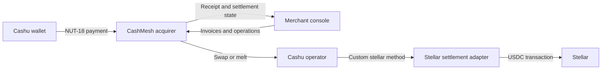
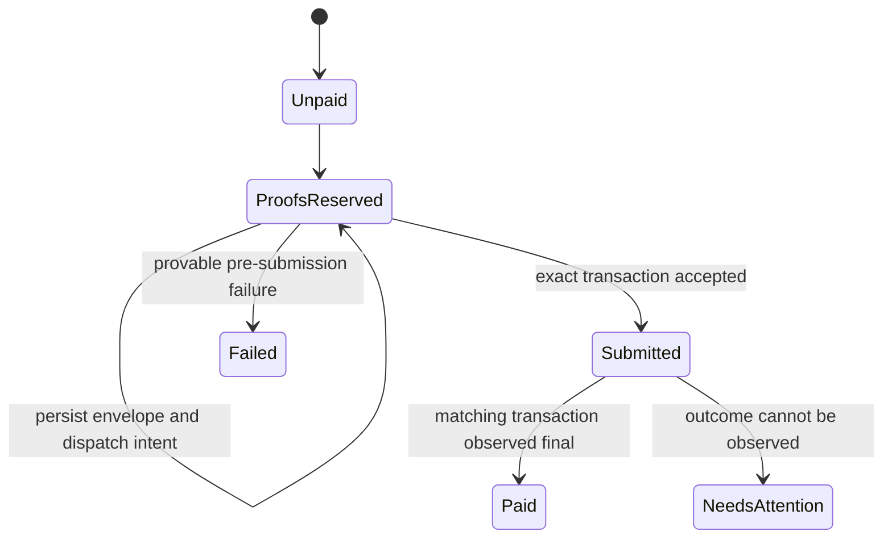

# Architecture

## Goals

CashMesh gives a merchant one acquiring interface over explicitly supported Cashu operators and settles
merchant value through Stellar. It must preserve the distinction between operator liabilities and make
ambiguous external effects recoverable.

The initial architecture optimizes for:

- deterministic policy and accounting logic;
- stock Cashu implementation compatibility;
- exact Stellar asset validation;
- at-most-once external payout behavior;
- independently deployable merchant, acquirer, and operator surfaces; and
- testability without funded accounts.

It does not initially optimize for net clearing, merchant-offline finality, private Stellar ingress or
egress, fiat payout, or horizontal service decomposition.

## Context



## Component Boundaries

### Domain Package

`packages/domain` owns rules that do not require a framework, database, Cashu library, or Stellar
client:

- integer minor-unit validation;
- operator tier and settlement-mode policy;
- versioned invoice lifecycle rules;
- balanced, operator-aware invoice-payment journals; and
- future ports for external effects.

It may depend only on small, runtime-independent utilities with a demonstrated need.

### Cashu Request Adapter

`packages/cashu` maps a validated open invoice and accepted operator routes to a strict NUT-18
request. It owns Cashu wire encoding, endpoint normalization, request-size limits, and a versioned
policy sidecar. It does not receive proofs or decide that an invoice has been paid.

The adapter pins a current release-candidate cashu-ts version behind this boundary. Its deterministic
`creqA` fixture is decoded by both cashu-ts and the independently pinned CDK types. See the
[merchant payment-request profile](cashu-payment-requests.md).

### Acquirer API

`services/acquirer-api` is the merchant-facing application boundary. It will own:

- invoice creation and lifecycle;
- NUT-18 request issuance and payment receipt;
- proof validation orchestration;
- operator policy evaluation;
- merchant ledger entries;
- settlement scheduling;
- receipts, refund records, webhooks, and reconciliation; and
- manual-attention workflows.

The API exposes health, operator-policy evaluation, and durable open-invoice creation and lookup.
Authentication, NUT-18 issuance over HTTP, payment receipt, and terminal invoice transitions are not
yet implemented.

### Merchant Console

`apps/merchant-console` is a reference operational client. It must remain replaceable by hosted
checkout, ecommerce plugins, or direct API clients. The current data is explicitly labeled as fixture
data and no payment state is presented as a live network result.

### Stellar Settlement Crate

`crates/stellar-settlement` owns the custom CDK payment boundary, exact Stellar profile, deposit
observer, durable compatibility journal, and payout recovery state. A pinned stock CDK gRPC server and
a read-only Horizon client adapt to its ports. Transaction signing and submission remain outside the
crate's implemented network effects. Submission must never be conflated with successful payment.

The current state model is:



Preparation metadata is persisted while the public state remains `proofs_reserved`. A final failed
ledger observation for that exact hash can terminate the obligation, but a timeout cannot. Once an
external effect may exist, the adapter observes its remote state before deciding whether proofs can be
released.

## Dependency Direction

```text
merchant-console -----> domain
acquirer-api ----------> domain
acquirer-api ----------> PostgreSQL
Cashu request adapter -> domain
Cashu request adapter -> cashu-ts
Cashu processor ------> stellar-settlement
Horizon reader -------> stellar-settlement
future payout signer --> stellar-settlement

domain ----------------> no application or network framework
stellar-settlement ----> no network client yet
```

The application layer may coordinate ports. Network adapters must not become the source of accounting
truth.

## Merchant Accounting Boundary

Payment acceptance is one domain operation that returns a paid invoice and its journal together. The
journal reference binds invoice, merchant, payment, operator, and settlement mode. Its posting shape is
limited to one operator e-cash or settlement-asset debit, one matching merchant-payable credit, and an
optional fee-revenue credit.

The invoice validity interval is `[createdAt, expiresAt)`. Payment and cancellation are invalid at the
expiry second; expiration is valid from that second onward. See the
[merchant accounting contract](merchant-accounting.md) for the version `1` fields and persistence
requirements.

## Operator Policy

| Operator tier | Requested hold | Requested conversion | Default |
|---|---|---|---|
| Trusted | Hold | Convert | Hold |
| Convertible-only | Convert | Convert | Convert |
| Unlisted | Reject | Reject | Reject |

This is merchant policy, not a universal operator rating. The same operator can receive a different
tier, cap, or suspension status for a different merchant.

## Money Representation

All business values use integer minor units. For initial USDC settlement:

```text
1 CashMesh usdc unit = 1 US cent
100 units = USDC 1.00
```

String parsing must reject signs, exponents, separators, and more than two decimal places. Serialization
schemas must declare integer bounds. Stellar's native asset precision must not cause silent rounding
into Cashu cents.

## Persistence

The settlement compatibility crate has a single-process, atomically replaced JSON journal to prove
cursor, claim, prepared-envelope, and payout recovery across restart. It is not the production database
or a multi-process coordination mechanism.

PostgreSQL is selected for acquirer persistence. The implemented initial migration stores open invoice
issuance and merchant-scoped idempotency records. It uses database constraints for domain bounds and a
deferred ownership foreign key so an idempotency reservation cannot commit without its invoice. See
the [merchant invoice API](invoice-api.md) for request and replay semantics.

Later migrations must preserve the fixed invoice and recovery contracts and provide atomic transitions
for:

- invoice state and accepted proof reservation;
- one idempotency key to one external payout attempt;
- merchant ledger debit/credit pairs;
- webhook delivery attempts; and
- reconciliation checkpoints.

An append-only event log may complement relational state, but it cannot replace enforceable uniqueness
and balance constraints.

## Deployment Shape

The first deployable environment should use:

- one merchant console;
- one acquirer API;
- one PostgreSQL database;
- two independently configured Cashu test operators; and
- one Stellar testnet settlement adapter per operator or clearly isolated account domain.

Splitting the acquirer into more services is deferred until operational load or ownership boundaries
justify it.

## Architecture Decisions

- [ADR-0001: Hybrid workspace boundaries](adr/0001-hybrid-workspace.md)
- [ADR-0002: Operator liabilities remain distinct](adr/0002-distinct-operator-liabilities.md)
- [ADR-0003: Direct settlement precedes clearing](adr/0003-direct-settlement-before-clearing.md)
- [ADR-0004: Stock CDK external processor for Stellar](adr/0004-stock-cdk-stellar-processor.md)
- [ADR-0005: Atomic merchant accounting](adr/0005-atomic-merchant-accounting.md)
- [ADR-0006: Isolated NUT-18 request adapter](adr/0006-isolate-nut18-request-adapter.md)
- [ADR-0007: PostgreSQL invoice issuance](adr/0007-postgres-invoice-issuance.md)
