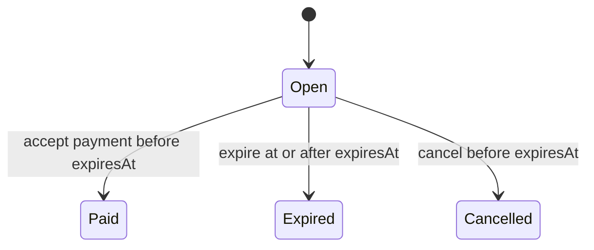

# Merchant Accounting Contract

**Status:** Domain contract and Cashu-ready open-invoice persistence implemented; payment orchestration
not implemented

This document defines the first CashMesh merchant invoice and journal schemas. Domain behavior remains
in `packages/domain`. The acquirer now persists open invoice issuance and its strict NUT-18 request
and can reject a bound payment envelope, but it does not validate or accept Cashu proofs, call an
operator, persist a paid-invoice journal, settle a merchant, or emit a receipt.

## Common Representation

- `schemaVersion` is `1` for every invoice and journal described here.
- `unit` is `usdc`; one unit is one US cent.
- Amounts are non-negative JavaScript safe integers. Invoices and postings must be positive.
- Times are non-negative Unix seconds represented as safe integers.
- Durable identifiers contain 1 through 128 constrained characters and must be globally unique in
  their identifier domain.
- Constructors project declared fields into new frozen records. Undeclared input fields are not copied
  into invoice, payment, account, reference, or posting records.

The fixed `usdc` unit is an accounting denomination. It does not make proofs from different operators
fungible or equivalent in risk.

## Invoice Schema

Every invoice has these fields:

| Field | Rule |
|---|---|
| `schemaVersion` | Exactly `1` |
| `unit` | Exactly `usdc` |
| `id` | Globally unique invoice identifier |
| `merchantId` | Merchant payable owner |
| `amount` | Positive US-cent amount |
| `createdAt` | Start of the validity window, inclusive |
| `expiresAt` | End of the validity window, exclusive and after `createdAt` |
| `state` | `open`, `paid`, `expired`, or `cancelled` |

The allowed transitions are:

Terminal invoices cannot transition again. A paid invoice adds `paidAt` and a payment record. An
expired invoice adds `expiredAt`; a cancelled invoice adds `cancelledAt`.

The payment record contains the acceptance time, gross amount, fee, merchant net amount, payment and
journal identifiers, operator, settlement mode, and structured asset account. `paidAt` is the proof
acceptance time. The journal's `effectiveAt` may be equal or later, but never earlier.

## Journal Schema

Each journal has an id, effective time, immutable invoice-payment reference, and at least two postings.
The reference binds all of:

- invoice id;
- merchant id;
- payment id;
- issuing operator id; and
- settlement mode.

Every posting has a positive amount, a `debit` or `credit` side, and one account:

| Account | Meaning |
|---|---|
| `operator_ecash:{operatorId}` | Cashu bearer value held against one named operator |
| `settlement_asset:{assetId}` | Explicit converted settlement asset |
| `merchant_payable:{merchantId}` | Amount CashMesh owes the merchant |
| `fee_revenue:usdc` | CashMesh fee revenue |

An invoice-payment journal permits exactly one asset debit, one credit to the referenced merchant, and
at most one fee credit. Debits and credits must balance exactly and each side's total must remain
within JavaScript safe-integer bounds.

For a trusted hold of USDC 12.34 with a USDC 0.34 fee:

| Side | Account | Amount |
|---|---|---:|
| Debit | `operator_ecash:operator-a` | 1,234 |
| Credit | `merchant_payable:merchant-001` | 1,200 |
| Credit | `fee_revenue:usdc` | 34 |

For immediate conversion of USDC 12.34 with no fee:

| Side | Account | Amount |
|---|---|---:|
| Debit | `settlement_asset:stellar-testnet-usdc-circle` | 1,234 |
| Credit | `merchant_payable:merchant-001` | 1,234 |

Trusted-hold asset accounts are operator-specific. Immediate conversion must debit a configured
settlement-asset account. Neither entry proves that proofs were valid or conversion succeeded; the
payment orchestrator must establish that fact before it invokes the accounting transition.

## Atomic Payment Persistence Contract

`acceptInvoicePaymentV1` returns the paid invoice and balanced journal together. A persistence adapter
must write both in one database transaction. At minimum that transaction must:

1. conditionally transition the invoice from `open` to `paid`;
2. insert the journal header and every posting;
3. enforce unique journal id, payment id, and paid-invoice reference;
4. commit all changes or none; and
5. schedule receipts and webhooks only after commit.

Batch uniqueness checks in the domain catch duplicates already present in one in-memory batch. They do
not replace database constraints, isolation, or an idempotency-key policy. Globally unique invoice,
payment, and journal identifiers are a required persistence invariant.

## Deliberate Limits

- Open invoice creation and lookup are implemented with PostgreSQL; terminal invoice and journal
  persistence are not.
- The invoice API attaches the strict NUT-18 request and inspects its payment envelope but never
  accepts the payment.
- No proofs, DLEQ evidence, keysets, operator fee quotes, or spent state are validated.
- The issued operator-policy snapshot is recorded; merchant-specific cap decisions and suspension
  state are not.
- No conversion, redemption, payout, refund, reversal, or chargeback entry exists.
- No ledger balance query or accounting export exists.
- No multi-currency or sub-cent accounting is supported.

Those capabilities require new typed records and entries. They must not mutate or reinterpret version
`1` records in place.
