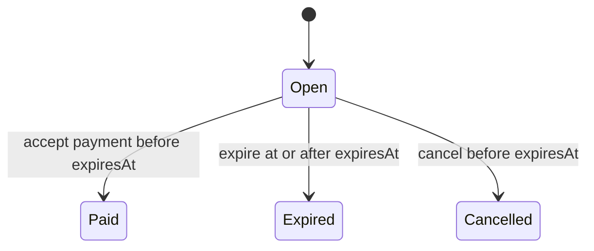

# Merchant Accounting Contract

**Status:** Domain contract and internal atomic accounting for confirmed immediate-conversion Stellar
melts implemented; public payment acceptance not implemented

This document defines the first CashMesh merchant invoice and journal schemas. Domain behavior remains
in `packages/domain`. The acquirer persists open invoice issuance and its strict NUT-18 request,
sanitized proof references, mint state evidence, encrypted bearer custody, Stellar quote observations,
and operator effects. An internal repository can now accept a confirmed immediate-conversion melt and
persist the paid invoice and journal atomically. The HTTP route does not orchestrate these capabilities,
settle a merchant, or emit a receipt.

## Common Representation

- `schemaVersion` is `1` for every invoice and journal described here.
- `unit` is `usdc`; one unit is one US cent.
- Amounts are non-negative JavaScript safe integers. Invoices and postings must be positive.
- Times are non-negative Unix seconds represented as safe integers.
- Durable identifiers contain 1 through 128 constrained characters and must be globally unique in
  their identifier domain.
- Constructors project declared fields into new frozen records. Undeclared input fields are not copied
  into invoice, payment, account, reference, or posting records.

The fixed `usdc` unit is an accounting denomination. It does not make proofs from different operators
fungible or equivalent in risk.

## Invoice Schema

Every invoice has these fields:

| Field | Rule |
|---|---|
| `schemaVersion` | Exactly `1` |
| `unit` | Exactly `usdc` |
| `id` | Globally unique invoice identifier |
| `merchantId` | Merchant payable owner |
| `amount` | Positive US-cent amount |
| `createdAt` | Start of the validity window, inclusive |
| `expiresAt` | End of the validity window, exclusive and after `createdAt` |
| `state` | `open`, `paid`, `expired`, or `cancelled` |

The allowed transitions are:

Terminal invoices cannot transition again. A paid invoice adds `paidAt` and a payment record. An
expired invoice adds `expiredAt`; a cancelled invoice adds `cancelledAt`.

The payment record contains the acceptance time, gross amount, fee, merchant net amount, payment and
journal identifiers, operator, settlement mode, and structured asset account. `paidAt` is the proof
acceptance time. The journal's `effectiveAt` may be equal or later, but never earlier.

## Journal Schema

Each journal has an id, effective time, immutable invoice-payment reference, and at least two postings.
The reference binds all of:

- invoice id;
- merchant id;
- payment id;
- issuing operator id; and
- settlement mode.

Every posting has a positive amount, a `debit` or `credit` side, and one account:

| Account | Meaning |
|---|---|
| `operator_ecash:{operatorId}` | Cashu bearer value held against one named operator |
| `settlement_asset:{assetId}` | Explicit converted settlement asset |
| `merchant_payable:{merchantId}` | Amount CashMesh owes the merchant |
| `fee_revenue:usdc` | CashMesh fee revenue |

An invoice-payment journal permits exactly one asset debit, one credit to the referenced merchant, and
at most one fee credit. Debits and credits must balance exactly and each side's total must remain
within JavaScript safe-integer bounds.

For a trusted hold of USDC 12.34 with a USDC 0.34 fee:

| Side | Account | Amount |
|---|---|---:|
| Debit | `operator_ecash:operator-a` | 1,234 |
| Credit | `merchant_payable:merchant-001` | 1,200 |
| Credit | `fee_revenue:usdc` | 34 |

For immediate conversion of USDC 12.34 with no fee:

| Side | Account | Amount |
|---|---|---:|
| Debit | `settlement_asset:stellar-testnet-usdc-circle` | 1,234 |
| Credit | `merchant_payable:merchant-001` | 1,234 |

Trusted-hold asset accounts are operator-specific. Immediate conversion must debit a configured
settlement-asset account. Neither entry proves that proofs were valid or conversion succeeded; the
payment orchestrator must establish that fact before it invokes the accounting transition.

## Atomic Payment Persistence Contract

`acceptInvoicePaymentV1` returns the paid invoice and balanced journal together. The PostgreSQL
lifecycle repository implements that contract for the pinned immediate-conversion Stellar testnet
USDC profile. Acceptance requires all of:

- the invoice is still `open` and the all-`SPENT` observation precedes its exclusive expiry;
- the complete issued request and ordered route policy reconstruct under their authenticated
  fingerprint, and the selected route is `immediate_conversion`;
- the complete stored Stellar quote attempt reconstructs under its fingerprint and pinned profile,
  and the exact effect-bound quote observation is durably `PAID`;
- the exact reserved proof set is durably all `SPENT` at or after that quote observation; and
- the debit account is the server-derived
  `settlement_asset:stellar-testnet-usdc-circle`, never a caller-selected label.

One database transaction then:

1. conditionally transition the invoice from `open` to `paid`;
2. insert the journal header and every posting;
3. append the linked `consumed` lifecycle event;
4. delete current encrypted bearer custody through the terminal-event trigger;
5. enforce unique journal id, payment id, and paid-invoice reference; and
6. commit all changes or none.

The proof observation time is `paidAt`; the terminal event time is the journal's `effectiveAt`.
Deferred database checks require exact invoice, merchant, reservation, operator, mint, authenticated
route set, effect, quote, proof-state, lifecycle, and posting agreement at commit. Journal and posting
rows, paid invoice fields, and issued route decisions are immutable afterward. Exact retries
reconstruct the same accounting, while changed identifiers, fees, times, or evidence conflict.
Receipts and webhooks must still be scheduled only after commit.

Batch uniqueness checks in the domain catch duplicates already present in one in-memory batch. They do
not replace database constraints, isolation, or an idempotency-key policy. Globally unique invoice,
payment, and journal identifiers are a required persistence invariant.

## Deliberate Limits

- PostgreSQL terminal persistence currently supports only paid invoices produced by confirmed
  immediate-conversion Stellar melts. Expiry and cancellation persistence are not implemented.
- The invoice API attaches the strict NUT-18 request and inspects its payment envelope but never
  invokes internal acceptance.
- Stored keyset and proof-state evidence, offline proof validation, proof-reference reservation,
  reservation lifecycle, encrypted custody, and Stellar quote evidence remain separately persisted
  inputs. The HTTP layer does not yet assemble them into a payment workflow.
- A bounded client can create and check a `stellar` melt quote, and a repository persists one attempt,
  outcome, and observation history per payment. The fresh-dispatch coordinator can record returned
  `PAID`, but it does not itself observe NUT-07 or invoke acceptance. Recovery observation remains a
  separate missing coordinator.
- Successful NUT-03 swaps cannot be accepted. Replacement proofs and their exact output custody are
  not durable yet, so trusted-hold accounting would claim an asset CashMesh cannot reconstruct.
- Upgrade refuses requests issued before authenticated route fingerprints. They require retirement or
  an explicitly reviewed route-policy backfill before migration can complete.
- The issued operator-policy snapshot is recorded; merchant-specific cap decisions and suspension
  state are not.
- No live conversion, redemption, merchant payout, refund, reversal, or chargeback entry exists.
- No ledger balance query or accounting export exists.
- No multi-currency or sub-cent accounting is supported.

Those capabilities require new typed records and entries. They must not mutate or reinterpret version
`1` records in place.
